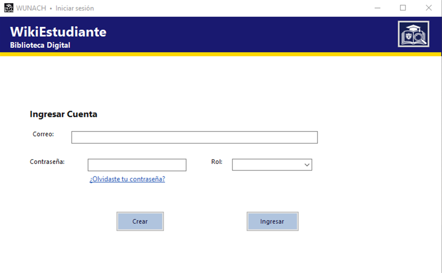
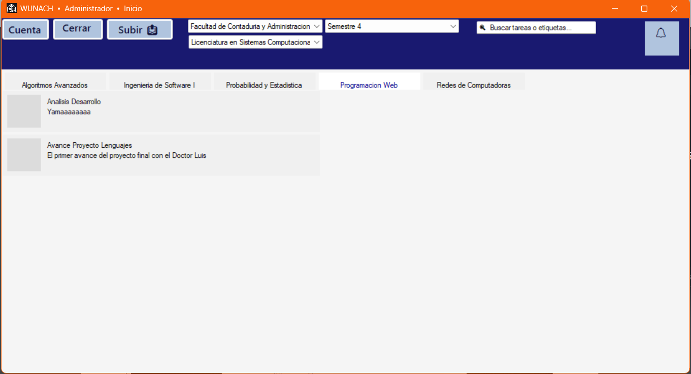
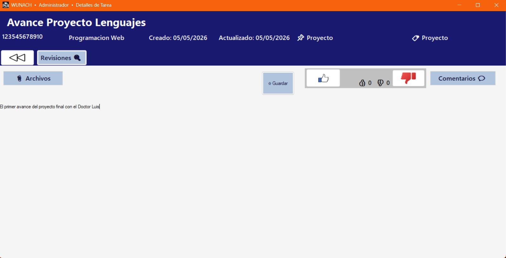
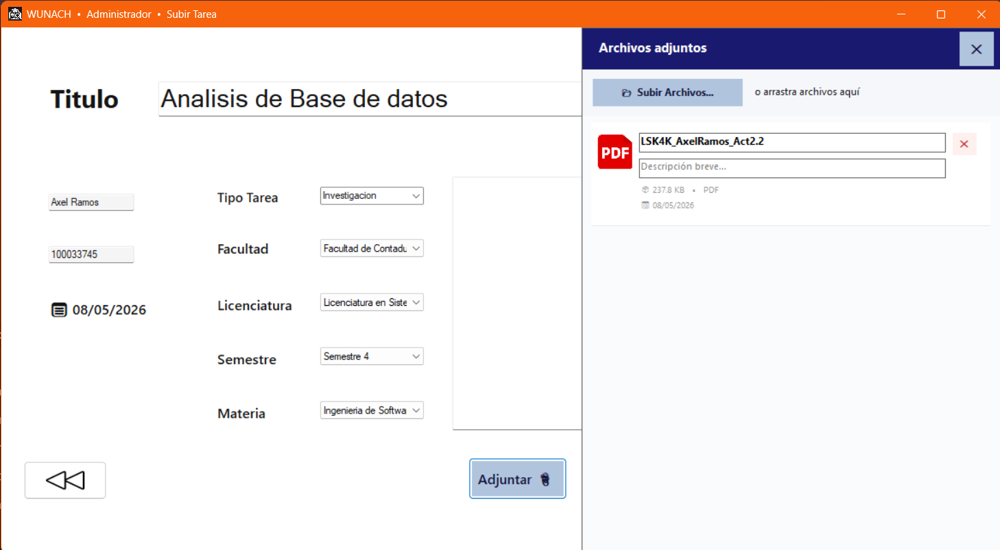
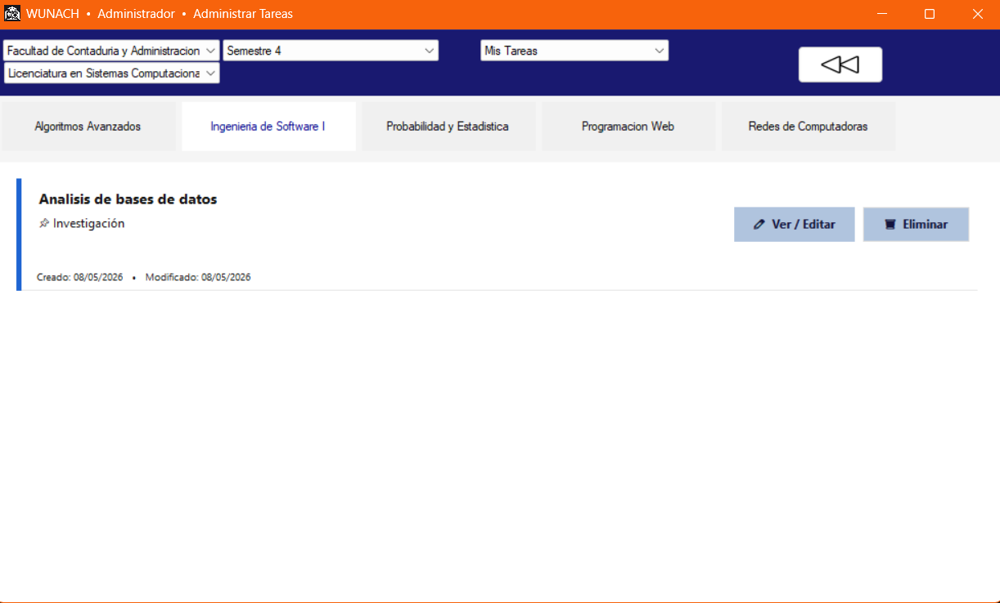

<div align="center">

  

  # WikiUnach — Biblioteca Digital Universitaria

  **Collaborative academic platform for the UNACH university community**

  [](https://github.com/axelramos54/WikiUnach/releases/latest)
  [](LICENSE)
  []()
  []()
  []()
  []()
  []()

  [📖 User Manual](docs/WikiUnach_Manual_de_Usuario.pdf) •
  [🏗️ Technical Docs](docs/WikiUnach_Documentacion_Tecnica.pdf)•
  [🎬 Demo Video](#-demo) •
  [⚙️ Setup Guide](#-installation--setup)

</div>

---

## 📌 Table of Contents

- [About the Project](#-about-the-project)
- [Key Features](#-key-features)
- [Architecture](#-architecture)
- [Tech Stack](#-tech-stack)
- [Screenshots](#-screenshots)
- [Demo](#-demo)
- [Installation & Setup](#-installation--setup)
- [Configuration](#-configuration)
- [Database Schema](#-database-schema)
- [Project Structure](#-project-structure)
- [Team](#-team)
- [License](#-license)

---

## 📚 About the Project

**WikiUnach** (WUNACH) is a collaborative desktop application built for the
student and faculty community of the **Universidad Autónoma de Chiapas (UNACH)**.
It solves a critical academic problem: valuable student work — assignments,
essays, research projects, and lab reports — is created once, submitted,
and then lost forever.

WikiUnach turns that work into a **living, searchable, version-controlled
digital library**, organized by Faculty → Degree → Semester → Subject.

### The Problem It Solves
> Students spend hours recreating work that already exists. Senior students'
> knowledge never reaches juniors. Academic material is fragmented across
> personal drives, WhatsApp groups, and email threads.

### The Solution
> A structured, role-based platform where students and teachers upload,
> discover, vote on, and build upon each other's academic work —
> permanently and collaboratively.

---

## ✨ Key Features

| Feature | Description |
|---|---|
| 🔐 **Role-Based Access** | Four roles: Visitor, Student, Teacher, Administrator |
| 📄 **Wiki Pages** | Create and edit academic content with full version history |
| 🔄 **Version Control** | Git-style commit history for every wiki page edit |
| ☁️ **Cloud File Storage** | Upload and download files via AWS S3 with pre-signed URLs |
| 💬 **Interaction System** | Comments, upvotes, downvotes, and bookmarks per page |
| 🔍 **Smart Search** | Search by title or tag across all published content |
| 🔔 **Notifications** | Real-time alerts for comments, likes, and admin actions |
| 📧 **Email Verification** | 6-digit code verification via Gmail SMTP on registration |
| 🔒 **Secure Admin Access** | Hidden admin panel protected by native C++/x86 ASM validator |
| 🎨 **Dynamic Themes** | Light/Dark themes with persistent user preferences |

---

## 🏗️ Architecture

┌──────────────────────────────────────────────────────────────┐
│                   CLIENT (Windows Desktop)					│
│                                                          		  	│
│   C# WinForms (.NET Framework 4.7.2)                    		   	│
│   ┌──────────┐ ┌──────────┐ ┌──────────┐ ┌──────────┐  	   	│
│   │ FrmAcceso	  │ │  FrmPrinc   │ │  FrmSubir   │ │ FrmDetall  │	   	│
│   └──────────┘ └──────────┘ └──────────┘ └──────────┘  	   	│
│   ┌────────────────────────────────────────────────────┐	     │
│   │  Services: DBConexion │ S3Service │ EmailService 		│	│
│   └────────────────────────────────────────────────────┘ 	│
│   ┌──────────────────────┐                               │
│   │  VerificadorAdmin.dll│  ← Native C++/x86 ASM        │
│   └──────────────────────┘                               │
└──────────────┬──────────────────────┬───────────────────┘
│                      │
▼                      ▼
┌──────────────────────┐  ┌───────────────────────────────┐
│  AWS RDS MySQL 8.0   │  │         AWS S3 Bucket          │
│  (us-east-2)         │  │  (Private + Pre-signed URLs)   │
│  - Users             │  │  - PDFs, DOCX, images, ZIP     │
│  - Wiki Pages        │  │  - Audio, video, code files    │
│  - Revisions         │  │                                │
│  - Comments / Votes  │  └───────────────────────────────┘
│  - Notifications     │
└──────────────────────┘
│
▼
┌──────────────────────┐
│    Gmail SMTP        │
│  (Email Verification │
│   & Password Reset)  │
└──────────────────────┘

---

## 🛠️ Tech Stack

### Frontend
| Technology | Purpose |
|---|---|
| C# / WinForms | Desktop UI with dynamic UserControls and FlowLayoutPanels |
| .NET Framework 4.7.2 | Application runtime |
| Visual Studio 2022 | IDE and build system |

### Cloud & Backend
| Technology | Purpose |
|---|---|
| AWS S3 | Binary file storage (private bucket, pre-signed URLs) |
| AWS RDS MySQL 8.0 | Relational database hosted on us-east-2 |
| Gmail SMTP | Email verification and password reset codes |

### Security
| Technology | Purpose |
|---|---|
| SHA-256 | Password hashing stored as hex in database |
| VerificadorAdmin.dll | Admin validation via native C++ / x86 Assembly |
| Pre-signed URLs | Temporary expiring S3 download links (15 min) |

### NuGet Packages
| Package | Purpose |
|---|---|
| `MySql.Data` | MySQL client connector |
| `AWSSDK.S3` | AWS S3 file operations |
| `AWSSDK.Core` | AWS SDK core utilities |
| `System.Net.Mail` | Built-in SMTP email client |

---

## 📸 Screenshots

### 🔐 Login Screen


---

### 🏠 Main Feed


---

### 📄 Wiki Page Detail


---

### 📤 Upload Task


---

### 🔄 Version History


---

### 🔒 Admin Panel


---

## 🎬 Demo

<div align="center">

[](https://www.youtube.com/watch?v=R0Z1kk0pd5I)

▶️ **[Watch Full Demo on YouTube](https://www.youtube.com/watch?v=R0Z1kk0pd5I)**

</div>

The demo covers:
- ✅ User login and role-based access
- ✅ Navigating Faculty → Degree → Semester → Subject
- ✅ Uploading files to AWS S3
- ✅ Wiki version history and commit comparison
- ✅ Real-time notifications
- ✅ Admin panel via native DLL validator
---

## 🚀 Installation & Setup

### Prerequisites

- ✅ **Windows 10 or later** (x86 or x64)
- ✅ **.NET Framework 4.7.2** — [Download here](https://dotnet.microsoft.com/en-us/download/dotnet-framework/net472)
- ✅ **Visual Studio 2022** with .NET desktop development workload
- ✅ **AWS Account** with an S3 bucket and RDS MySQL instance configured
- ✅ **Gmail Account** with App Password enabled

---

### Step 1 — Clone the Repository

```bash
git clone https://github.com/axelramos54/WikiUnach.git
cd WikiUnach
```

### Step 2 — Set Up Configuration

Copy the config template and fill in your credentials:

```bash
cp App.config.template src/App.config
```

Open `src/App.config` and replace all placeholder values:

```xml
<add key="AWS_AccessKey"  value="YOUR_AWS_ACCESS_KEY" />
<add key="AWS_SecretKey"  value="YOUR_AWS_SECRET_KEY" />
<add key="AWS_BucketName" value="your-s3-bucket-name" />
<add key="AWS_Region"     value="us-east-2" />
<add key="SMTP_User"      value="your-email@gmail.com" />
<add key="SMTP_Pass"      value="your-gmail-app-password" />
```

### Step 3 — Restore NuGet Packages

Open the solution in Visual Studio → right-click the solution in Solution
Explorer → **"Restore NuGet Packages"**

### Step 4 — Set Build Target to x86

> ⚠️ **Critical:** `VerificadorAdmin.dll` is compiled for **x86**.
> The project MUST be built as x86 or it will crash at runtime.

In Visual Studio:
1. Go to **Build → Configuration Manager**
2. Set **Active Solution Platform** to `x86`

### Step 5 — Set Up the Database

Run the SQL migration script against your MySQL instance:

```bash
mysql -u YOUR_DB_USER -p YOUR_DATABASE < src/Database/Migracion_AdminFeatures.sql
```

### Step 6 — Build and Run

Press **`F5`** in Visual Studio or use **Build → Build Solution (`Ctrl+Shift+B`)**.

Make sure `VerificadorAdmin.dll` is in the same output folder as `WUNACH.exe`.

---

## ⚙️ Configuration

All credentials are managed through `App.config` which is **never committed**.
Use `App.config.template` as your starting point.

| Key | Description | Where to get it |
|---|---|---|
| `AWS_AccessKey` | AWS IAM access key ID | AWS Console → IAM → Users |
| `AWS_SecretKey` | AWS IAM secret access key | AWS Console → IAM → Users |
| `AWS_BucketName` | Your S3 bucket name | AWS Console → S3 |
| `AWS_Region` | AWS region identifier | Match your RDS region |
| `SMTP_User` | Gmail address for sending | Your Gmail account |
| `SMTP_Pass` | Gmail App Password | [myaccount.google.com/apppasswords](https://myaccount.google.com/apppasswords) |

> ⚠️ **Never commit `App.config` with real credentials.**
> The `.gitignore` in this repo blocks it automatically.

---

## 🗄️ Database Schema

The database follows **3rd Normal Form (3NF)** with 12 normalized tables.

Facultades ──< Licenciaturas ──< Materias ──< PaginasWiki
│
┌────────────────┼──────────────┐
▼                ▼              ▼
Revisiones       Comentarios      Archivos
│
┌─────────────────────┼──────────┐
▼                     ▼          ▼
Usuarios              Votos     Bookmarks
│
┌─────────┴──────────┐
▼                    ▼
Notificaciones          Etiquetas

Full schema reference: [`database/schema.md`](database/schema.md)

---

## 📁 Project Structure

WikiUnach/
├── README.md
├── LICENSE
├── App.config.template          ← Safe config template (no credentials)
├── .gitignore
│
├── src/                         ← All source code
│   ├── WUNACH.slnx              ← Visual Studio solution file
│   ├── Forms/                   ← WinForms screens (.cs, .Designer.cs, .resx)
│   ├── Services/                ← Cloud & database services
│   ├── Helpers/                 ← Utility classes
│   ├── Native/                  ← VerificadorAdmin.dll (C++/x86 ASM)
│   ├── Assets/                  ← Application icon and file type icons
│   └── Database/                ← SQL migration scripts
│
├── docs/                        ← Documentation
│   ├── Manual_de_Usuario.pdf
│   ├── Documentacion_Tecnica.pdf
│   ├── Revision_de_Proyecto.pdf
│   └── screenshots/             ← UI screenshots
│
└── database/
└── schema.md                ← Database schema reference

---

## 👥 Team

| Name | Role |
|---|---|
| **Axel Ramos Monroy** | Lead Developer — Architecture, AWS, WinForms |
| **Carlos Adolfo Ortiz Ortiz** | Database Design & SQL |
| **Ruth Carolina Moscoso Villatoro** | UI/UX & Documentation |
| **Luis Roberto Miranda De La Cruz** | Backend Services & Testing |

**Academic Context:**
- 🏫 Universidad Autónoma de Chiapas (UNACH)
- 🎓 Licenciatura en Sistemas Computacionales — 4to Semestre, Grupo K
- 📚 Subject: Lenguajes de Consulta
- 👨‍🏫 Professor: Dr. Luis Gutiérrez Alfaro

---

## 📄 License

This project is licensed under the **MIT License** — see the
[LICENSE](LICENSE) file for details.

---

<div align="center">

**Built with ❤️ for the UNACH student community**

⭐ If you found this project useful, please consider starring the repository!

</div>